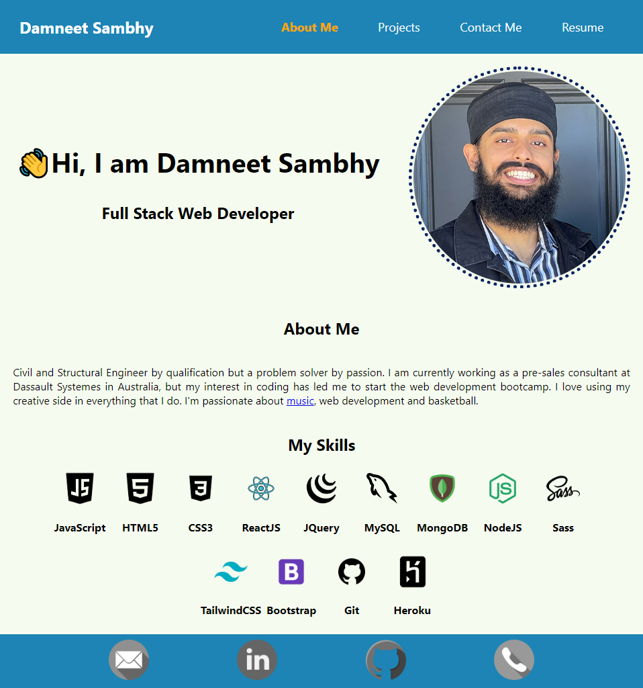

# react-portfolio

## Description
Single page react portfolio. All components are styled using styled components library.

## Table of Contents
1. [Installation](#installation)
2. [Usage](#usage)
3. [License](#license)
4. [Contributing](#contributing)
5. [Tests](#tests)
6. [Questions](#questions)

## Installation
- To install the application locally please follow the instructions below.
```bash
- git clone git@github.com:daman29/react-portfolio.git
- npm install
```
- Then run the app in dev mode
```bash
- npm run start
```


## Usage
- Run the application with the following command:
```bash
- npm run start
```
- Then visit [localhost:3000](localhost:3000) to use the app or [Click on this link]() to visit the live application on Heroku..

- Visit the application repository at [GitHub Repository](https://github.com/daman29/react-portfolio)

The image below shows the portfolio



## License
- This application is licensed under the [MIT License](./LICENSE)

## Contributing
- Clone repository first using git clone
- Contribute your changes to a new branch

## Tests
- No test commands

## Questions
- Reach me via email at damneet.sambhy@hotmail.com or issues on [github](https://github.com/daman29)